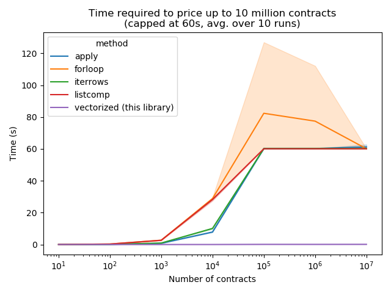

# py_vollib_vectorized


## Introduction

The `py_vollib_vectorized` package makes pricing thousands of option contracts and calculating greeks fast and effortless.
It is built on top of the `py_vollib` library.
Upon import, it will automatically patch the corresponding `py_vollib` functions so as to support vectorization.
Inputs can then be passed as floats, tuples, lists, `numpy.array`, or `pandas.Series`.
Automatic broadcasting is performed on the inputs.

On top of vectorization, modifications to py_vollib include additional `numba` speedups; as such, `numba` is required.
These speedups make `py_vollib_vectorized` the fastest library for pricing option contracts.

See the [documentation](https://py_vollib_vectorized.readthedocs.io/en/latest) for more details.

## Installation

    pip install py_vollib_vectorized
    
## Requirements

* Written for Python 3.5+
* Requires py_vollib, numba, numpy, pandas, scipy

## Code samples

The library can be used in two ways.
Upon import, it monkey-patches (i.e. replaces) the corresponding functions in `py_vollib`.

As a more versatile alternative, users that would prefer to work with a dedicated option pricing API can make use of the utility functions provided by the library.

#### Patching `py_vollib`

```python
# The usual py_vollib syntax

import numpy as np
import pandas as pd

import py_vollib.black_scholes
flag = 'c'  # 'c' for call, 'p' for put
S = 100  # Underlying asset price
K = 90  # Strike
t = 0.5  # (Annualized) time-to-expiration
r = 0.01  # Interest free rate
iv = 0.2  # Implied Volatility

option_price = py_vollib.black_scholes.black_scholes(flag, S, K, t, r, iv)  # 12.111581435

# This library keeps the same syntax, but you can pass as input any iterable of values.
# This includes list, tuple, numpy.array, pd.Series, pd.DataFrame (with only a single column).
# Note that you must pass a value for each contract as *no broadcasting* is done on the inputs.


# Patch the original py_vollib library by importing py_vollib_vectorized
import py_vollib_vectorized  # The same functions now accept vectors as input!

# Note that the input arguments are broadcasted.
# You can specify ints, floats, tuples, lists, numpy arrays or Series.

flag = ['c', 'p']  # 'c' for call, 'p' for put
S = (100, 100)  # Underlying asset prices
K = [90]  # Strikes
t = pd.Series([0.5, 0.6])  # (Annualized) times-to-expiration
r = np.array([0.01])  # Interest free rates
iv = 0.2  # Implied Volatilities

option_price = py_vollib.black_scholes.black_scholes(flag, S, K, t, r, iv, return_as='array')  
# array([12.11158143,  2.02418536])
```

#### Utility functions
We also define other utility functions to get all contract prices, implied volatilities, and greeks in a single call.

```python
import pandas as pd
from py_vollib_vectorized import price_dataframe, get_all_greeks

# Using the data above, we can calculate all contracts greeks in a single call
greeks = get_all_greeks(flag, S, K, t, r, iv, model='black_scholes', return_as='dict')

#   {'delta': array([ 0.80263679, -0.21293214]),
#    'gamma': array([0.0196385, 0.01875498]),
#    'theta': array([-0.01263557, -0.00964498]),
#    'rho': array([0.34073321, -0.13994668]),
#    'vega': array([0.19626478, 0.22493816])}

# We can also price a dataframe easily by specifying a dataframe and the corresponding columns

df = pd.DataFrame()
df['Flag'] = ['c', 'p']
df['S'] = 95
df['K'] = [100, 90]
df['T'] = 0.2
df['R'] = 0.2
df['IV'] = 0.2
result = price_dataframe(df, flag_col='Flag', underlying_price_col='S', strike_col='K', annualized_tte_col='T',
                     riskfree_rate_col='R', sigma_col='IV', model='black_scholes', inplace=False)
#   Price       delta       gamma       theta       rho        vega
#   2.895588    0.467506    0.046795    -0.045900   0.083035   0.168926
#   0.611094    -0.136447   0.025739    -0.005335   -0.027151  0.092838

```

See the [documentation](https//py_vollib_vectorized.readthedocs.io/en/latest) for more details.

## Benchmarking

Compared to looping through contracts or to using built-in pandas functionality, this library is very memory efficient and scales fast and well to a large number of contracts.




## Acknowledgements

This library optimizes the `py_vollib` codebase, itself built upon Peter Jäckel's *Let's be rational* methodology.
